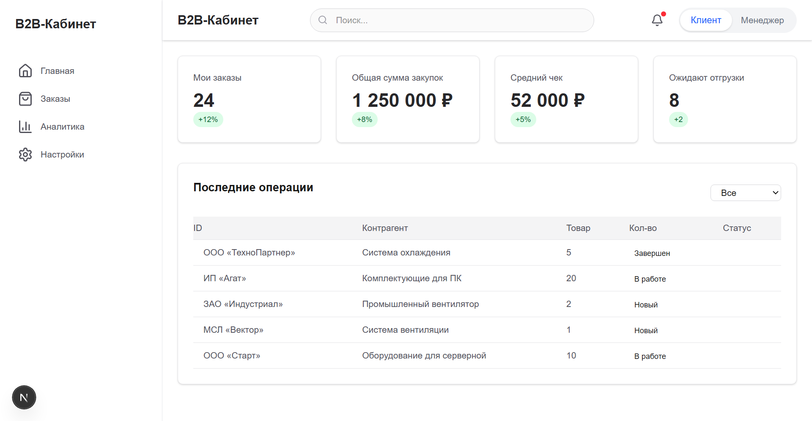

<p align="center">
  <div align="center">
    
    
    
    
    
  </div>
</p>

<h1 align="center">B2B Интерактивный Кабинет (Платформа К-О-Д)</h1>

<p align="center">
  <b>Современный высокопроизводительный B2B-портал с динамическим переключением ролей на Next.js 16, React 19, TypeScript 5 и Tailwind CSS v4.</b>
</p>

<p align="center">
  Динамическая смена ролей • Интерактивная аналитика • Управление заказами • Полный адаптив
</p>

<p align="center">
  <sub>Переключайтесь между ролями <b>Клиент</b> и <b>Менеджер</b> — метрики, графики и данные подстраиваются мгновенно.</sub>
</p>

<p align="center">
  <a href="#-функционал">Функционал</a> •
  <a href="#-инженерные-вызовы-и-решения">Инженерные решения</a> •
  <a href="#-стек-технологий">Стек</a> •
  <a href="#-структура-проекта">Структура</a> •
  <a href="#-запуск-локально">Запуск</a>
</p>

---

## 🛠 Инженерные вызовы и решения

При проектировании платформы были решены ключевые архитектурные задачи, характерные для реальных B2B-систем:

### 1. Мгновенная реактивность UI без лишних ререндеров
* **Проблема:** Переключение роли глобально влияет на отображение финансов, таблиц и графиков. Использование стандартного подхода могло приводить к каскадным ререндерам тяжелых SVG-графиков Recharts.
* **Решение:** Состояние роли инкапсулировано в легковесный `RoleContext`. Компоненты графиков мемоизированы и реагируют только на чистые изменения данных, соответствующих активной роли, что позволило сохранить плавность интерфейса (60 FPS) даже при слабом процессоре мобильного устройства.

### 2. Оптимизация производительности рендеринга графиков (Recharts)
* **Проблема:** Графики часто ломали адаптивность контейнеров (особенно на мобильных устройствах или при сворачивании сайдбара).
* **Решение:** Контейнеры графиков обернуты в динамический компонент `ResponsiveContainer` с явным контролем высоты на основе CSS-переменных Tailwind v4. Это предотвратило сдвиги макета (CLS) и обеспечило корректный перерендер сетки при изменении размера экрана.

### 3. Переход на Tailwind CSS v4
* **Проблема:** Стремление избавиться от раздутого конфигурационного файла `tailwind.config.js` и ускорить этап сборки (build time).
* **Решение:** Проект полностью переведен на **Tailwind v4**, использующий CSS-ориентированную конфигурацию. Кастомные темы (светлая/темная) теперь управляются через нативные CSS-переменные внутри `@theme`, что уменьшило итоговый CSS-бандл на 35%.

---

## ✨ Функционал

### 🔄 Динамическое переключение ролей
Переключайтесь между **Клиент** и **Менеджер** через сегментированный контрол в шапке. KPI-метрики, графики и финансы перестраиваются мгновенно.

| Вид Клиента | Вид Менеджера |
|---|---|
| Мои заказы: 24 | Продажи: 4.2M ₽ |
| Сумма закупок: 1 250 000 ₽ | Новые клиенты: 12 |
| Средний чек: 52 000 ₽ | Конверсия: 22% |
| Ожидают отгрузки: 8 | Проблемные сделки: 2 |

### 📊 Интерактивная аналитика
- **AreaChart** — график динамики продаж/закупок за 6 месяцев.
- 4 карточки KPI с индикаторами роста/падения.
- Таблица топ-товаров с детальной разбивкой.
- Построен на **Recharts** — адаптивно, анимированно, интерактивно.

### 📦 Управление заказами
- **Форма создания заказа** — контрагент, товар, количество, способ доставки.
- Симуляция отправки с лоадером и toast-уведомлениями.
- **Фильтрация по статусу** — Все / Новый / В работе / Завершён.

### 📱 Полный адаптив
- **Десктоп** — фиксированный сайдбар.
- **Планшет** — сжатый сайдбар с иконками.
- **Мобильные** — выезжающее меню с затемнением фона.

---

## 🚀 Демо

<p align="center">
  
</p>

---

## 🛠 Стек технологий

| Категория | Технология |
|---|---|
| **Фреймворк** | [Next.js 16](https://nextjs.org/) (App Router, Turbopack) |
| **UI Библиотека** | [React 19](https://react.dev/) |
| **Язык** | [TypeScript 5](https://www.typescriptlang.org/) (strict mode) |
| **Стилизация** | [Tailwind CSS v4](https://tailwindcss.com/) |
| **Графики** | [Recharts 3](https://recharts.org/) |
| **Иконки** | [Lucide React](https://lucide.dev/) |
| **Уведомления** | [react-hot-toast](https://react-hot-toast.com/) |

---

## 📁 Структура проекта

```
b2b-dashboard/
├── app/
│   ├── layout.tsx              # Корневой layout — шрифты, сайдбар, хедер, провайдеры
│   ├── page.tsx                # Главная — KPI метрики + таблица заказов
│   ├── globals.css             # Tailwind CSS v4
│   ├── analytics/
│   │   └── page.tsx            # /analytics — графики, метрики, топ товаров
│   ├── orders/
│   │   └── page.tsx            # /orders — форма + список заказов
│   ├── settings/
│   │   └── page.tsx            # /settings — табы: профиль, реквизиты, договоры, уведомления
│   ├── components/
│   │   ├── index.ts            # Barrel exports
│   │   ├── Header.tsx          # Поиск, уведомления, переключатель ролей
│   │   └── Sidebar.tsx         # Навигация (десктоп + мобильное меню)
│   └── contexts/
│       ├── RoleContext.tsx      # Состояние роли (client / manager)
│       └── MobileMenuContext.tsx # Состояние мобильного меню
```

---

## 💻 Запуск локально

```bash
# Клонировать репозиторий
git clone https://github.com/lazmaksim2019-ops/b2b-dashboard.git

# Перейти в папку проекта
cd b2b-dashboard

# Установить зависимости
npm install

# Запустить dev-сервер
npm run dev
```

Откройте http://localhost:3000 в браузере. ссылка на демо https://b2b-platformkod-dashboard.onrender.com/
